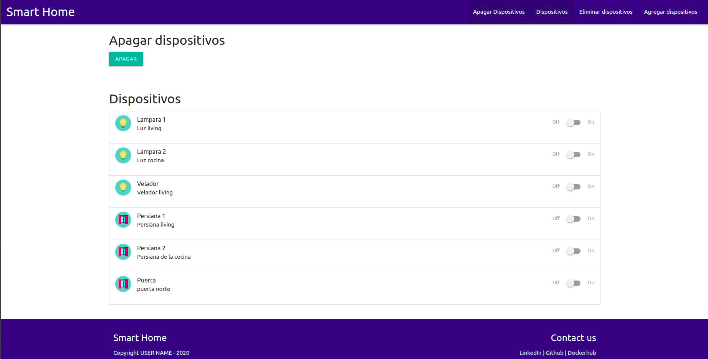
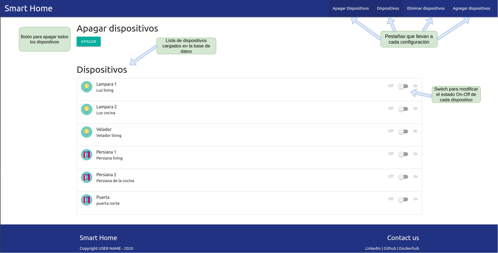
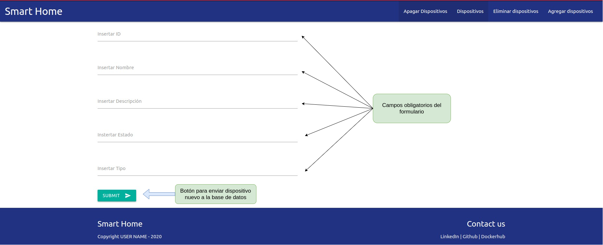
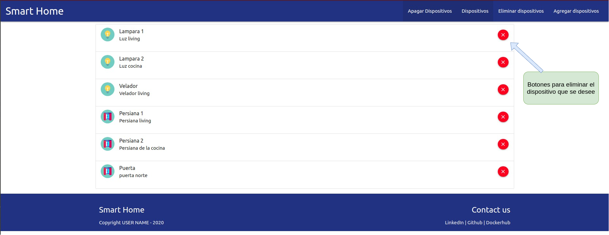
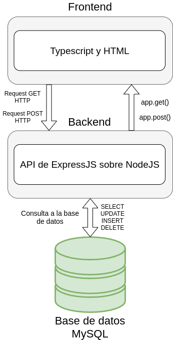

# DAW Project Template

Authors:

* Agustin Bassi
* Brian Ducca
* Santiago Germino

Template project for Web Applications Development.

To read all project documentation, please go to its wiki in [this link](https://github.com/ce-iot/daw-project-template/wiki).

## Smart Home proyect

## Contenido:

* [Introducción](#Introducción)
* [Herramientas](#Herramientas)
* [Requerimientos](#Requerimientos)
* [Como ejecutar](#Como ejecutar)
* [Funcionalidad](#Funcionalidad)
  * [Página principal](#Página principal)
* [Maquetado](#Maquetado)
* [Frontend y Backend](#Frontend y Backend)
* [Finalización](#Finalización)

## Introducción

La aplicación Smart Home simula el control y manejo básico de distintos dispositivos en un hogar a través de una aplicación web. Fue desarrollada en el marco de entrega como trabajo final de la materia Desarrollo de aplicaciones web de la 3er cohorte en IoT (3CEIoT) dicatada en la UBA. 
Es altamente recomendable la lectura de la [documentación](https://github.com/ce-iot/daw-project-template/wiki) existente en el templeate daw-proyect para entender el funcionamiento y manejo de las herramientas utilizadas para correr y desarrollar este proyecto 

## Herramientas

* [Docker](https://www.docker.com/why-docker)
* [Docker Compose](https://docs.docker.com/compose/)
* [Materializecss](https://materializecss.com/)
* [TypeScript](https://github.com/ce-iot/daw-project-template/wiki/Typescript)
* [MySQL](https://github.com/ce-iot/daw-project-template/wiki/MySQL)
* [NodeJS](https://github.com/ce-iot/daw-project-template/wiki/NodeJS)
* [PhpMyAdmin](https://github.com/ce-iot/daw-project-template/wiki/PhpMyAdmin)
* [Visual Studio Code](https://code.visualstudio.com/) como entorno de desarrollo

## Requerimientos

Para poder correr la aplicación correctamente, es necesario realizar la [instalación y configuración](https://github.com/IngBotek/daw-project/blob/master/doc/Instalaci%C3%B3nDocker.pdf) del Docker y Docker Compose.

## Como ejecutar

Habiendo completada la descarga y configuración de las herramientas, debe descargar el contenido de este repositorio, para ello puede posicionarse por linea de comando dentro del directorio donde desea guardar el proyecto y ejecutar la siguiente linea de comando:
```
git clone https://github.com/IngBotek/daw-project.git
```
Descargado el proyecto, entrar a la carpeta daw-proyect usando el comando cd:
```
cd daw-proyect
```
y estando dentro del directorio, levantar el Docker Compose introduciendo la siguiente linea:
```
docker-compose up
```
Hay que esperar unos segundos a que se levanten todos los servicios especificados en el archivo [docker-compose.yml](https://github.com/IngBotek/daw-project/blob/master/docker-compose.yml). Si es la primera vez que ejecuta `docker-compose up`, hay que esperar a que se descarguen los contenedores de los servicios faltantes. Habiendo finalizado la inicialización de los servicios, abrir el navegador y dirigirse a http://localhost:8000, donde debería visualizarse una pagina como la siguiente: 



## Funcionalidad

Se explica a continuación el funcionamiento de la aplicación.

## Página principal

Dentro de la página principal se visualizan todos los dispositivos registrados como así tambien se destacan todas las acciones que permite la aplicación:
* Apagar todos los dispositivos.
* Apagar y prender individualmente cada dispositivo.
* Agregar nuevo dispositivos.
* Quitar un dispositivo.



La página principal contiene la lista de dispositivos registrados, cada uno con un switch que permite cambiar los estados On-Off. También tenemos un botón general para apagar todos los dispositivos al mismo tiempo. En la parte superior derecha tenemos las pestañas que llevan a las otras funcionalidades como: 

* Agregar dispositivos: haciendo click en ésta pestaña se mostrará un formulario el cual requiere completar todos sus campos antes de enviar y registrar un nuevo dispositivo. 



* Quitar dispositivos: haciendo click en ésta pestaña se mostrara la lista de dispositivos ya registrados, cada uno con un botón que permitirá eliminarlos de la lista y la base de datos. 



Todas redireccionan a la página index principal una vez que se realiza una acción. Las pestañas Apagar dispositivos y Dispositivos llevan a la página principal ya que es allí donde se encuentran. 

## Maquetado
Para la implementación de estilos, acciones, botones, switches y formularios de la aplicación se usó [materializecss](https://materializecss.com/), un framework CSS que facilita el uso de estilos y funcionalidades ya sea en un sitio web o aplicación basada en estándares web.

## Frontend y Backend
El frontend está compuesto en gran medida por código Typescript y HTML. El compilador de Typescript solicitado en el [docker-compose.yml](https://github.com/IngBotek/daw-project/blob/master/docker-compose.yml) se ocupa de generar automáticamente el archivo javascript para la ejecución de la aplicación. Este código javascript es interpretado por el navegador, muestra la página e interpreta la acciones sobre ella como puente al backend.

El backend está compuesto por una API de [express](https://developer.mozilla.org/es/docs/Learn/Server-side/Express_Nodejs/Introduction) corriendo sobre [NodeJS](https://developer.mozilla.org/es/docs/Learn/Server-side/Express_Nodejs/Introduction). Express es el framework web más popular de Node, y es la librería subyacente para un gran número de otros frameworks web de Node. La API se ocupa de atender y responder a todos los request del cliente teniendo acceso a la base de datos MySQL para realizar todos los cambios y modificaciones necesarios. 



## Finalización
Para terminar la ejecucion, ir al terminal donde se está ejecutando docker-compose (donde ejecutó `docker-compose up`) y presionar `ctrl + c`, una vez termine de finalizar los servicios ejecutar `docker-compose down` para terminar la ejecución de docker compose.

## Licence

This project is published under GPLV3+ licence.


